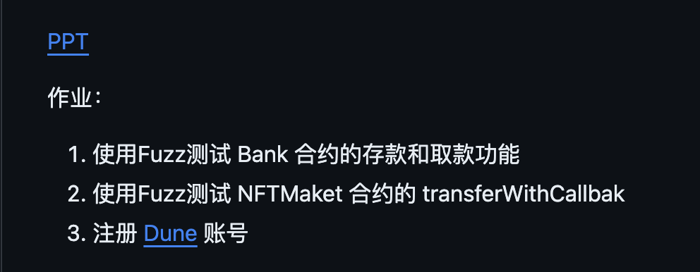
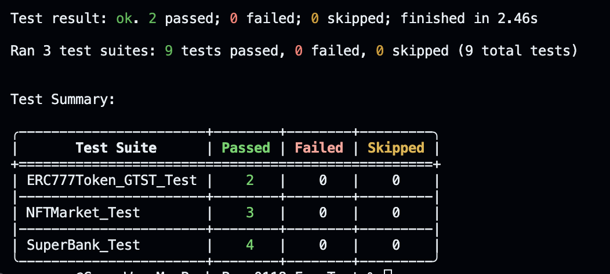
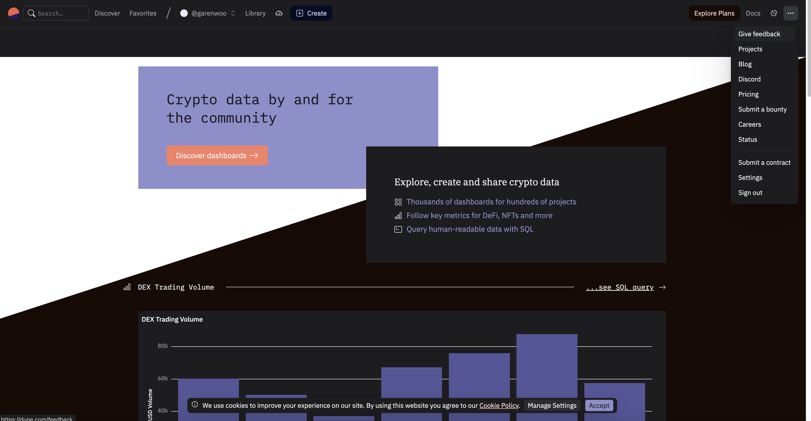

# 练习题（01.18）



## 1. 使用 Fuzz 测试 Bank 合约的存款和取款功能

在 Bank 合约存款和取款的方法分别为：depositETH 和 withdrawETH

**Bank 合约名**：<u>SuperBank</u>（可支持 ETH 和 不同地址的 ERC20 token 的存入）

**ERC20 token 合约名**：ERC20Token_GTT

**SafeERC20 token 合约名**：ERC777Token_GTST（也是 ERC777 Token）

#### Fuzz 测试用例（测试 Bank 合约的 ETH 存款和取款）：

```solidity
// SPDX-License-Identifier: MIT
pragma solidity ^0.8.0;

import {Test, console} from "forge-std/Test.sol";
import "../src/ERC20Token_GTT.sol";
import "../src/ERC777Token_GTST.sol";
import "../src/Bank.sol";
import "../src/SuperBank.sol";

contract SuperBank_Test is Test {
    address admin = makeAddr("admin");
    address alice = makeAddr("alice");
    address bob = makeAddr("bob");
    address carol = makeAddr("carol");
    /* Notice:
    1. GTT is ERC20 Token
    2. GTST is SafeERC20 Token and also ERC777 token
    */
    ERC20Token_GTT public GTT_Contract;
    ERC777Token_GTST public GTST_Contract;
    SuperBank public SuperBank_Contract;
    address public GTT_Addr;
    address public GTST_Addr;
    address public SuperBank_Addr;

    function setUp() public {
        vm.startPrank(admin);
        GTT_Contract = new ERC20Token_GTT();
        GTT_Addr = address(GTT_Contract);
        GTST_Contract = new ERC777Token_GTST();
        GTST_Addr = address(GTST_Contract);
        SuperBank_Contract = new SuperBank();
        SuperBank_Addr = address(SuperBank_Contract);
        vm.stopPrank();
    }

    // Case 1: Test ETH value in depositETH()
    /// forge-config: default.fuzz.runs = 10000
    function testFuzz_depositETH_testValue(uint _value) public {
        uint maxBalance = 10000 ether;
        vm.assume(_value <= maxBalance);
        deal(alice, maxBalance);

        bytes4 selector_depositETH = bytes4(keccak256("depositETH()"));
        bytes memory data = abi.encodeWithSelector(selector_depositETH);

        vm.prank(alice);
        (bool success, ) = SuperBank_Addr.call{value: _value}(data);
        console.log("SuperBank_Addr.balance:", SuperBank_Addr.balance);
        assertTrue(success);
        assertEq(
            SuperBank_Addr.balance,
            _value,
            "ETH Balance of Alice in SuperBank should equal deposited value of ETH"
        );
    }

    // Case 2: Test when recipient in withdrawETH() is not the owner of SuperBank
    /// forge-config: default.fuzz.runs = 10000
    function testFuzz_withdrawETH_testRecipient(address _recipient) public {
        uint maxBalance = 10000 ether;
        vm.assume(_recipient != admin);
        deal(_recipient, maxBalance);
        bytes4 selector_depositETH = bytes4(keccak256("depositETH()"));
        bytes memory data = abi.encodeWithSelector(selector_depositETH);
        vm.prank(_recipient);
        (bool success, ) = SuperBank_Addr.call{value: 1}(data);
        bytes memory encodedRevertMessage = abi.encodeWithSignature(
            "NotOwner(address,address)",
            _recipient,
            SuperBank_Contract.owner()
        );
        vm.expectRevert(encodedRevertMessage);
        vm.prank(_recipient);
        SuperBank_Contract.withdrawETH();
        assertTrue(
            SuperBank_Addr.balance > 0,
            "Because the recipient is not the owner of SuperBank, the ETH balance of Bigbank is not 0 after calling withdrawETH()"
        );
    }

    // Case 3: Test amount of ERC20 token in depositToken()
    /// forge-config: default.fuzz.runs = 10000
    function testFuzz_depositToken_testAmount(uint _amount) public {
        vm.startPrank(admin);
        uint GTT_totalSupply = GTT_Contract.totalSupply();
        uint GTST_totalSupply = GTST_Contract.totalSupply();
        vm.assume(_amount <= GTT_totalSupply && _amount <= GTST_totalSupply);
        GTT_Contract.transfer(alice, GTT_totalSupply); // The token balance of Alice equals the total supply of GTT(ERC20 token)
        GTST_Contract.transfer(bob, GTST_totalSupply); // The token balance of Bob equals the total supply of GTST(SafeERC20&ERC777 token)
        vm.startPrank(alice);
        GTT_Contract.approve(SuperBank_Addr, GTT_totalSupply);
        SuperBank_Contract.depositToken(GTT_Addr, _amount);
        assertEq(
            SuperBank_Contract.getTokenBalance(GTT_Addr, alice),
            _amount,
            "The GTT balance of Alice should equal deposited token amount"
        );
        vm.startPrank(bob);
        GTST_Contract.approve(SuperBank_Addr, GTST_totalSupply);
        SuperBank_Contract.depositToken(GTST_Addr, _amount);
        vm.stopPrank();
        assertEq(
            SuperBank_Contract.getTokenBalance(GTST_Addr, bob),
            _amount,
            "The GTST balance of Bob should equal deposited token amount"
        );
    }

    // Case 4: Test amount of ERC20 token in withdrawToken()
    /// forge-config: default.fuzz.runs = 10000
    function testFuzz_withdrawToken_testRecipient(address _recipient) public {
        vm.assume(_recipient != admin);
        vm.startPrank(admin);
        uint GTT_totalSupply = GTT_Contract.totalSupply();
        uint GTST_totalSupply = GTST_Contract.totalSupply();
        GTT_Contract.transfer(alice, GTT_totalSupply); // The token balance of Alice equals the total supply of GTT(ERC20 token)
        GTST_Contract.transfer(bob, GTST_totalSupply); // The token balance of Bob equals the total supply of GTST(SafeERC20&ERC777 token)
        
        vm.startPrank(alice);
        GTT_Contract.approve(SuperBank_Addr, GTT_totalSupply);
        SuperBank_Contract.depositToken(GTT_Addr, 1);

        vm.startPrank(bob);
        GTST_Contract.approve(SuperBank_Addr, GTST_totalSupply);
        SuperBank_Contract.depositToken(GTST_Addr, 1);
        vm.stopPrank();

        bytes memory encodedRevertMessage = abi.encodeWithSignature(
            "NotOwner(address,address)",
            _recipient,
            SuperBank_Contract.owner()
        );

        vm.expectRevert(encodedRevertMessage);
        vm.prank(_recipient);
        SuperBank_Contract.withdrawToken(GTT_Addr);

        vm.expectRevert(encodedRevertMessage);
        vm.prank(_recipient);
        SuperBank_Contract.withdrawToken(GTST_Addr);
    }
}
```


## 2. 使用 Fuzz 测试 NFTMaket 合约的 transferWithCallback

在 token 合约中实现 “<u>向 NFTMarket 合约转入 token 来购买 NFT</u>” 功能的方法为 **transferWithCallbackForNFT** 。

**token 合约名**：<u>ERC777Token_GTST</u>

**NFTMarket 合约名**：<u>NFTMarket</u>

#### Fuzz 测试用例（测试 ERC777Token_GTST 合约的 transferWithCallbackForNFT 方法）：

```solidity
// SPDX-License-Identifier: MIT
pragma solidity ^0.8.0;

import {Test, console} from "forge-std/Test.sol";
import "../src/NFTMarket.sol";
import "../src/ERC777Token_GTST.sol";
import "../src/ERC721Token.sol";

contract ERC777Token_GTST_Test is Test {
    address admin = makeAddr("admin");
    address alice = makeAddr("alice");
    address bob = makeAddr("bob");
    address carol = makeAddr("carol");
    ERC777Token_GTST public tokenContract;
    ERC721Token public nftContract;
    NFTMarket public nftMarketContract;
    address public tokenAddr;
    address public nftAddr;
    address public marketAddr;

    function setUp() public {
        vm.startPrank(admin);
        tokenContract = new ERC777Token_GTST();
        tokenAddr = address(tokenContract);
        nftContract = new ERC721Token();
        nftAddr = address(nftContract);
        nftMarketContract = new NFTMarket(tokenAddr);
        marketAddr = address(nftMarketContract);
        vm.stopPrank();
    }

    // Case 1: Test param0(_to) of transferWithCallbackForNFT() in NFTMarket contract.
    // Because NFTMarket is required to realize transferWithCallbackForNFT() in advance,
    // So, this case is not suitable for fuzz testing.

    // Case 2: test param1(_bidAmount) of transferWithCallbackForNFT() in NFTMarket contract
    /// forge-config: default.fuzz.runs = 10000
    function testFuzz_transferWithCallbackForNFT_testBidAmount(
        uint _bidAmount
    ) public {
        uint tokenTotalSupply = tokenContract.totalSupply();
        vm.assume(_bidAmount >= 1 && _bidAmount <= tokenTotalSupply);
        vm.startPrank(admin);
        tokenContract.transfer(alice, tokenTotalSupply);
        nftContract.mint(alice, "No.0");
        nftContract.mint(bob, "No.1");
        vm.stopPrank();

        vm.prank(alice);
        tokenContract.approve(marketAddr, _bidAmount);

        vm.startPrank(bob);
        nftContract.approve(marketAddr, 1);
        nftMarketContract.list(nftAddr, 1, 1);
        vm.stopPrank();

        bytes memory _dataOfNFT1 = abi.encode(nftAddr, 1);

        vm.prank(alice);
        tokenContract.transferWithCallbackForNFT(
            marketAddr,
            _bidAmount,
            _dataOfNFT1
        );
        vm.prank(bob);
        uint tokenBalanceOfSeller = nftMarketContract.getBalance();
        assertEq(tokenBalanceOfSeller, _bidAmount, "The token balance of Bob in NFTMarket should equals _bidAmount");
    }

    // Case 3: test param2(_data) of transferWithCallbackForNFT() in NFTMarket contract
    // Subcase 1 of Case 3: test param0(_NFTAddr) of getBytesOfNFTInfo() which returns _data
    // Because _NFTAddr is limited to be the same as a ERC721Token Address, which requires the ERC721Token contract deployed in advance,
    // So, this subcase is not suitable for fuzz testing.

    // Subcase 2 of Case 3: test param1(_tokenId) of getBytesOfNFTInfo() which returns _data
    // Because _tokenId is limited to be the ones of NFT minted, which requires tester know those _tokenId(s) in advance,
    // So, this subcase is not suitable for fuzz testing.

    // Case 4: test NFT-seller's address in transferWithCallbackForNFT()
    /// forge-config: default.fuzz.runs = 10000
    function testFuzz_transferWithCallbackForNFT_testSellerAddress(
        address _sellerAddr
    ) public {
        uint tokenTotalSupply = tokenContract.totalSupply();
        vm.assume(_sellerAddr != address(0));
        vm.startPrank(admin);
        tokenContract.transfer(alice, tokenTotalSupply);
        nftContract.mint(alice, "No.0");
        nftContract.mint(_sellerAddr, "No.1");
        vm.stopPrank();

        vm.prank(alice);
        tokenContract.approve(marketAddr, tokenTotalSupply);

        vm.startPrank(_sellerAddr);
        nftContract.approve(marketAddr, 1);
        nftMarketContract.list(nftAddr, 1, 100 * 10 ** 18);
        vm.stopPrank();

        bytes memory _dataOfNFT1 = abi.encode(nftAddr, 1);

        vm.prank(alice);
        tokenContract.transferWithCallbackForNFT(
            marketAddr,
            101 * 10 ** 18,
            _dataOfNFT1
        );
        vm.prank(_sellerAddr);
        uint tokenBalanceOfSeller = nftMarketContract.getBalance();
        assertEq(tokenBalanceOfSeller, 101 * 10 ** 18, "The token balance of Bob in NFTMarket should equals 101 * 10 ** 18");
    }
}
```


#### Fuzz 测试用例（测试 NFTMarket 合约的 tokensReceived 方法）：

```solidity
// SPDX-License-Identifier: MIT
pragma solidity ^0.8.0;

import {Test, console} from "forge-std/Test.sol";
import "../src/NFTMarket.sol";
import "../src/ERC777Token_GTST.sol";
import "../src/ERC721Token.sol";

contract NFTMarket_Test is Test {
    address admin = makeAddr("admin");
    address alice = makeAddr("alice");
    address bob = makeAddr("bob");
    address carol = makeAddr("carol");
    ERC777Token_GTST public tokenContract;
    ERC721Token public nftContract;
    NFTMarket public nftMarketContract;
    address public tokenAddr;
    address public nftAddr;
    address public marketAddr;

    function setUp() public {
        vm.startPrank(admin);
        tokenContract = new ERC777Token_GTST();
        tokenAddr = address(tokenContract);
        nftContract = new ERC721Token();
        nftAddr = address(nftContract);
        nftMarketContract = new NFTMarket(tokenAddr);
        marketAddr = address(nftMarketContract);
        vm.stopPrank();
    }

    // Case 1: Test param0(_recipient) of tokensReceived() in NFTMarket contract
    /// forge-config: default.fuzz.runs = 10000
    function testFuzz_tokensReceived_testRecipient(address _recipient) public {
        uint tokenTotalSupply = tokenContract.totalSupply();
        vm.assume(_recipient != address(0) && _recipient != bob);
        vm.startPrank(admin);
        tokenContract.transfer(_recipient, tokenTotalSupply);
        nftContract.mint(_recipient, "No.0");
        nftContract.mint(bob, "No.1");
        vm.stopPrank();

        vm.prank(_recipient);
        tokenContract.approve(marketAddr, 10000 * 10 ** 18);

        vm.startPrank(bob);
        nftContract.approve(marketAddr, 1);
        nftMarketContract.list(nftAddr, 1, 100 * 10 ** 18);
        vm.stopPrank();

        bytes memory _dataOfNFT1 = abi.encode(nftAddr, 1);

        vm.prank(_recipient);
        nftMarketContract.tokensReceived(
            _recipient,
            marketAddr,
            101 * 10 ** 18,
            _dataOfNFT1
        );
        vm.prank(bob);
        uint tokenBalanceOfSeller = nftMarketContract.getBalance();
        assertEq(tokenBalanceOfSeller, 101 * 10 ** 18, "The token balance of Bob in NFTMarket should equals 101 * 10 ** 18");
    }

    // Case 2: Test param1(_calledContract) of tokensReceived() in NFTMarket contract.
    // Because NFTMarket is required to realize tokensReceived() in advance,
    // So, this case is not suitable for fuzz testing.

    // Case 3: test param2(_amount) of tokensReceived() in NFTMarket contract
    /// forge-config: default.fuzz.runs = 10000
    function testFuzz_tokensReceived_testAmount(uint _amount) public {
        uint tokenTotalSupply = tokenContract.totalSupply();
        vm.assume(_amount >= 1 && _amount <= tokenTotalSupply);
        vm.startPrank(admin);
        tokenContract.transfer(alice, tokenTotalSupply);
        nftContract.mint(alice, "No.0");
        nftContract.mint(bob, "No.1");
        vm.stopPrank();

        vm.prank(alice);
        tokenContract.approve(marketAddr, _amount);

        vm.startPrank(bob);
        nftContract.approve(marketAddr, 1);
        nftMarketContract.list(nftAddr, 1, 1);
        vm.stopPrank();

        bytes memory _dataOfNFT1 = abi.encode(nftAddr, 1);

        vm.prank(alice);
        nftMarketContract.tokensReceived(
            alice,
            marketAddr,
            _amount,
            _dataOfNFT1
        );
        vm.prank(bob);
        uint tokenBalanceOfSeller = nftMarketContract.getBalance();
        assertEq(tokenBalanceOfSeller, _amount, "The token balance of Bob in NFTMarket should equals _bidAmount");
    }

    // Case 4: test param3(_data) of tokensReceived() in NFTMarket contract
    // Subcase 1 of Case 4: test param0(_NFTAddr) of getBytesOfNFTInfo() which returns _data
    // Because _NFTAddr is limited to be the same as a ERC721Token Address, which requires the ERC721Token contract deployed in advance,
    // So, this subcase is not suitable for fuzz testing.

    // Subcase 2 of Case 4: test param1(_tokenId) of getBytesOfNFTInfo() which returns _data
    // Because _tokenId is limited to be the ones of NFT minted, which requires tester know those _tokenId(s) in advance,
    // So, this subcase is not suitable for fuzz testing.

    // Case 5: test NFT-seller's address in tokensReceived()
    /// forge-config: default.fuzz.runs = 10000
    function testFuzz_tokensReceived_testSellerAddress(
        address _sellerAddr
    ) public {
        uint tokenTotalSupply = tokenContract.totalSupply();
        vm.assume(_sellerAddr != address(0));
        vm.startPrank(admin);
        tokenContract.transfer(alice, tokenTotalSupply);
        nftContract.mint(alice, "No.0");
        nftContract.mint(_sellerAddr, "No.1");
        vm.stopPrank();

        vm.prank(alice);
        tokenContract.approve(marketAddr, tokenTotalSupply);

        vm.startPrank(_sellerAddr);
        nftContract.approve(marketAddr, 1);
        nftMarketContract.list(nftAddr, 1, 100 * 10 ** 18);
        vm.stopPrank();

        bytes memory _dataOfNFT1 = abi.encode(nftAddr, 1);

        vm.prank(alice);
        nftMarketContract.tokensReceived(
            alice,
            marketAddr,
            101 * 10 ** 18,
            _dataOfNFT1
        );
        vm.prank(_sellerAddr);
        uint tokenBalanceOfSeller = nftMarketContract.getBalance();
        assertEq(tokenBalanceOfSeller, 101 * 10 ** 18, "The token balance of Bob in NFTMarket should equals 101 * 10 ** 18");
    }
}
```


### 测试结果



## 3. 注册 Dune 账号

已注册完成，界面如下：


